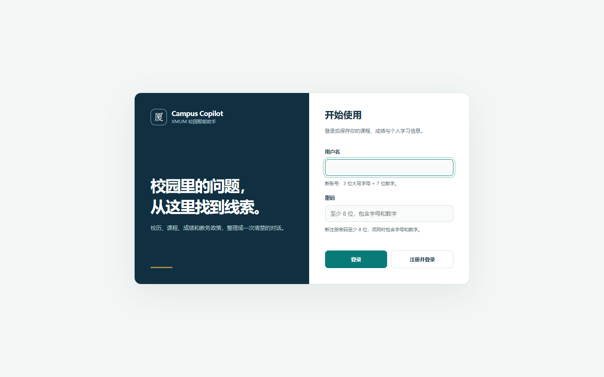
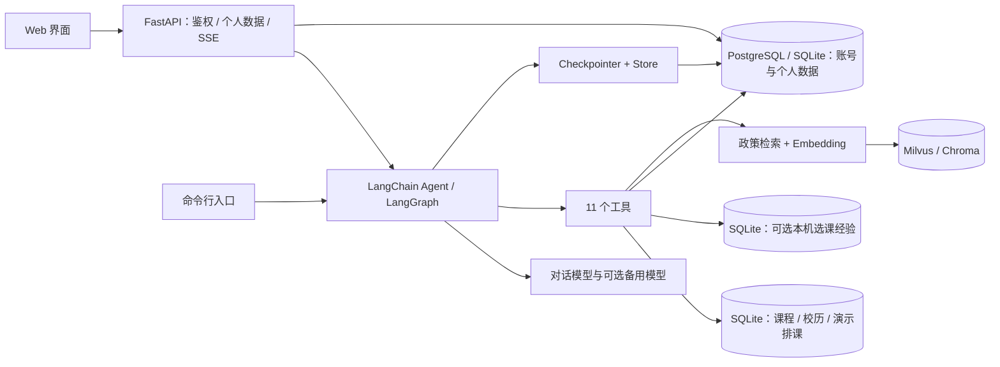

# Campus Copilot · 校园智能助手

[](https://github.com/z2947428561-star/campus-copilot/actions/workflows/ci.yml)


面向校园信息查询的 AI 助手：用 RAG 检索教务政策，用结构化工具查询课程、校历和教室，并根据登录用户录入的成绩计算 GPA。基于 LangChain / LangGraph、FastAPI 和原生 Web 界面构建。

**当前目标：仅在本机运行和验证。** 浏览器通过 `127.0.0.1:8000` 访问，应用在本机 Python 环境运行；仓库暂不提供服务器部署、域名或 HTTPS 反向代理方案。以厦门大学马来西亚分校（XMUM）场景为例，非学校官方服务，尚未接入学校教务账号或实时选课系统。

本机运行不等于完全离线：默认对话模型和 Embedding 仍调用外部 API。已有本机 PostgreSQL / Milvus 可以继续使用；轻量路径可选 SQLite / Chroma。

[快速开始](#快速开始) · [架构与代码阅读指南](docs/architecture.md) · [本地开发](docs/local-development.md) · [评估报告](docs/eval-results.md) · [贡献指南](CONTRIBUTING.md)



## 能做什么

| 能力 | 示例 | 数据与边界 |
| --- | --- | --- |
| 政策问答 | “重修要交钱吗？” | 检索人工整理的政策快照，返回来源；以学校最新原文为准 |
| 校历查询 | “2026 年 10 月 5 日是第几教学周？” | 版本化校历种子数据，目前覆盖 2026 年九月学期 |
| 课程与教室查询 | “CS101 有什么先修课？”“周三 10 点哪有空教室？” | 公共课程目录和演示排课，非实时教务数据 |
| 个人课程与成绩 | 在“个人数据”中录入课程、成绩，再查询个人课表或 GPA | 按登录用户隔离；新账号不会自动获得演示成绩 |
| GPA 分析确认 | “帮我算一下这学期 GPA” | 计算前展示确认操作，网页支持批准或拒绝 |
| 持久化记忆 | “记住我是大一学生” | 会话状态与长期画像分别保存，按用户隔离 |
| 选课经验查询（本机可选） | “经验表里有哪些 Python 相关课程？” | 读取本机导入的学生共编表，保留出处与不同意见；原始评价不随仓库公开 |

Web 支持注册、登录、退出、SSE 流式回答和个人数据管理。当前共有 **11 个 Agent 工具**；主模型默认使用 DeepSeek 的 OpenAI 兼容接口，可配置独立的备用模型和可选 LangSmith 追踪。

## 架构



这是一个模块化单体应用。公共结构化数据、个人数据和政策向量分别存储；前端由 FastAPI 同源提供，不需要单独的 Node.js 构建步骤。详见[请求链路、模块职责与阅读顺序](docs/architecture.md)。

## 快速开始

以下是**新克隆仓库**的轻量本地路径，使用 SQLite + Chroma，无需先启动 PostgreSQL 或 Milvus。使用 **Python 3.13**；对话与建知识库仍需要各自的模型 API 配置。

```bash
git clone https://github.com/z2947428561-star/campus-copilot.git
cd campus-copilot
python -m venv .venv
```

激活环境：

```powershell
# Windows PowerShell
.\.venv\Scripts\Activate.ps1
Copy-Item .env.example .env
```

```bash
# macOS / Linux
source .venv/bin/activate
cp .env.example .env
```

编辑 `.env`，填入 `DEEPSEEK_API_KEY` 和 `EMBED_API_KEY`，并设置：

```dotenv
MEMORY_BACKEND=sqlite
KB_BACKEND=chroma
LANGSMITH_TRACING=false
LLM_FALLBACK_PROVIDER=none
```

然后在项目根目录运行：

```bash
python -m pip install -r requirements.txt
python scripts/init_db.py
python scripts/build_kb.py
python -m uvicorn src.server:app --host 127.0.0.1 --port 8000
```

浏览器打开 [http://127.0.0.1:8000/](http://127.0.0.1:8000/)，先注册再登录。用户名为 3 位大写专业缩写 + 7 位数字；密码至少 8 位，同时包含字母和数字。请通过这个地址访问页面。

`init_db.py` 会重建公共种子库，`build_kb.py` 会重建向量索引；已有数据时先阅读[本地开发说明](docs/local-development.md)。未配置模型和索引时可以查看页面、使用账号功能，但完整对话与政策检索不可用。

已有 Conda `.venv` 环境的 Windows 用户可继续使用 `run_web.cmd`；它要求解释器位于 `.venv\python.exe`，与标准 venv 的目录布局不同。PostgreSQL / Milvus 的接入方式也见[本地开发说明](docs/local-development.md)。

## 检查与评估

```bash
# 不调用模型 API，使用临时目录和临时数据库
python scripts/check_offline.py
```

GitHub Actions 只做代码检查，不部署应用；运行相同的 7 个离线测试文件，覆盖账号规则、登录限流、个人数据隔离、API 边界、密码重置、Chroma 重建及选课经验导入/查询。经验库测试只用虚构样例，不复制本机原始评价。它不代表真实模型问答或本机 PostgreSQL / Milvus 已通过集成验证。

[历史评估报告](docs/eval-results.md)记录：**2026-09-26 的 32 道自建题通过 32 道，其中 27 道工具路由断言全部通过**。判定使用关键词规则和实际执行的 ToolMessage；这是一组固定题目的结果，不等于开放问题准确率，也不是本次文档更新重新跑出的数据。

真实模型评估会调用外部 API，并写入测试账号、会话或报告；运行前请看[检查分层与隔离要求](docs/local-development.md#测试与评估)。

## 项目导航

| 入口 | 内容 |
| --- | --- |
| [架构与代码阅读指南](docs/architecture.md) | 一次请求如何流转、存储边界、主要文件职责与推荐阅读顺序 |
| [本地开发](docs/local-development.md) | Windows / Linux 环境、配置、启动、测试与常见问题 |
| [本机基础设施](ops/README.md) | 已有 PostgreSQL / Milvus 的本机端口绑定与数据保留注意事项 |
| [数据说明](docs/data-plan.md) | 公开文档快照、演示种子数据及尚未接入的真实数据 |
| [选课经验](docs/course-recommendations.md) | 本机 Excel 导入、经验搜索与原始评价查询、来源与隐私边界 |
| [评估记录](docs/eval-results.md) | 固定测试集的历史结果与评估口径 |
| [课程对照](docs/course-map.md) | 尚硅谷 LangChain 课程学习内容与代码落点 |
| [开发里程碑](docs/milestones.md) | 分阶段实现过程与已记录的问题 |

## 当前边界与后续工作

- 仅支持本机单实例使用；启动时绑定 `127.0.0.1`，不将应用或数据库端口对外开放。
- 课程、教室和排课包含演示数据；个人成绩由用户录入，未连接学校系统。学期仍有固定配置。
- 政策知识库是人工整理的离线快照，尚未自动同步，也未完整记录采集日期。
- 登录限流在单进程内生效；浏览器 token 使用 localStorage。注册仅校验用户名格式，不证明学生身份。
- 模型和 Embedding 服务会接收相关请求内容；LangSmith 默认关闭，PII 规则也不能保证覆盖所有个人信息。
- 后续重点：本机启动与恢复体验、真实数据更新流程、多学期支持、检索评估、多标签页请求处理与依赖锁定。

欢迎通过 [Issues](https://github.com/z2947428561-star/campus-copilot/issues) 反馈可复现问题，提交改动前请阅读 [CONTRIBUTING.md](CONTRIBUTING.md)。仓库暂未指定许可证。
