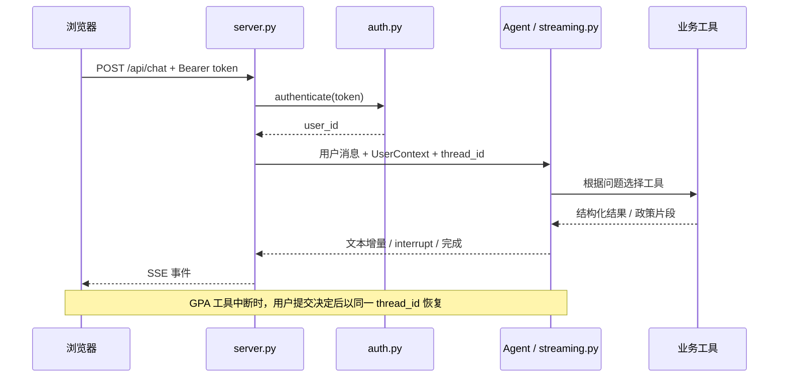

# 架构与代码阅读指南

本文对应当前仓库实现，目标仅为本机运行。Campus Copilot 是一个模块化 Python 单体应用：本机 FastAPI 提供同源 Web 页面和 API，LangChain Agent 根据问题调用工具，LangGraph 保存会话与中断现场。CLI 和 Web 共用 Agent 的组装与流式处理代码。`src/server.py` 是本机 Web 必需的后端，不是独立的服务器部署方案。

## 一次聊天请求怎么走

1. `src/static/index.html` 管理页面、登录状态、个人数据表单与流式事件消费。
2. `src/server.py` 校验 Bearer token，把服务端确认的身份放进 `UserContext`，再生成用户会话标识。客户端不能自行指定聊天身份。
3. `src/agent/assistant.py` 组装模型、9 个工具、提示词、中间件、Checkpointer 和 Store；Web 按进程延迟创建并复用 Agent。
4. `src/agent/streaming.py` 统一处理模型增量、工具结果和人工确认中断。Web 的工作线程把事件送入队列，HTTP 响应边接收边发送。
5. 工具根据用途访问公共 SQLite、个人数据存储或向量库，再由模型生成回答。GPA 由 Python 代码计算，不交给模型心算。

SSE 事件类型包括 `token`、`interrupt`、`done`、`error`。恢复请求使用 `resume` 或 `decisions`，不是另建一个会话。

当前网页提供单个确认操作的批准/拒绝按钮；API 和公共流式处理层还支持完整 `decisions`（包含参数修改）。网页尚未实现参数编辑和多动作逐项确认界面。

## 数据放在哪里

| 数据 | 主路径 | 本地替代 | 主要代码 |
| --- | --- | --- | --- |
| 公共课程、校历、教室、演示排课 | `data/campus.db`（SQLite） | 无切换，始终是 SQLite | `scripts/init_db.py`、`src/tools/` |
| 账号、token 哈希、个人成绩和选课 | PostgreSQL | `MEMORY_BACKEND=sqlite` 时使用 `data/memory.db` 或配置路径 | `src/auth.py`、`src/student_data.py` |
| 会话状态、人工确认中断现场 | PostgreSQL Checkpointer | SQLite Checkpointer | `src/agent/memory.py` |
| 长期用户画像 | PostgreSQL Store | SQLite Store | `src/agent/memory.py`、`src/tools/profile.py` |
| 政策向量与片段元数据 | Milvus | Chroma 本地目录 | `src/kb.py`、`scripts/build_kb.py` |
| 政策快照和公共种子数据 | Git 跟踪的 Markdown / JSON | — | `data/raw_docs/`、`data/structured/` |

`MEMORY_BACKEND` 同时影响账号、个人数据和记忆层；更换它或 `DATABASE_URL` **不会迁移旧账号**。这能解释“换了配置之后原账号登录不了”的一种情形。

公共种子库里的演示成绩不会自动写入注册用户的成绩。`calculate_gpa` 和 `query_my_schedule` 从运行时身份读取个人数据；公共课程目录仍用于补充课程名、学分等信息。

## 推荐阅读顺序

按一条请求链读，比按文件名字母顺序读更容易建立整体理解。

| 顺序 | 文件 | 重点看什么 |
| --- | --- | --- |
| 1 | [`src/server.py`](../src/server.py) | Web 入口、生命周期、依赖鉴权、请求到 Agent 的转换、SSE |
| 2 | [`src/static/index.html`](../src/static/index.html) | API 如何被调用、token 如何携带、确认操作如何恢复请求 |
| 3 | [`src/auth.py`](../src/auth.py) | 注册、PBKDF2 密码哈希、token 校验、退出和进程内限流 |
| 4 | [`src/context.py`](../src/context.py) + [`src/agent/runtime.py`](../src/agent/runtime.py) | 用户身份、thread_id、递归限制和追踪配置的区别 |
| 5 | [`src/agent/assistant.py`](../src/agent/assistant.py) | Agent 依赖的统一组装点，以及 CLI 各阶段的能力开关 |
| 6 | [`src/tools/__init__.py`](../src/tools/__init__.py) | 9 个工具的清单和分组，再按下表读实现 |
| 7 | [`src/agent/streaming.py`](../src/agent/streaming.py) | 流式输出与 HITL 中断/恢复为何能被 Web 和 CLI 共用 |
| 8 | [`src/agent/middleware.py`](../src/agent/middleware.py) | PII 规则、摘要、GPA 路由、审计、调用限额、备用模型和确认 |
| 9 | [`src/agent/memory.py`](../src/agent/memory.py) | Checkpointer 与 Store 的职责、后端切换、连接生命周期 |
| 10 | [`src/kb.py`](../src/kb.py) + [`scripts/build_kb.py`](../scripts/build_kb.py) | Embedding、切分、元数据、Milvus/Chroma 接入和索引重建 |
| 11 | [`src/config.py`](../src/config.py) + [`src/model.py`](../src/model.py) | 配置优先级、模型构建、超时、重试和备用模型配置 |
| 12 | [`scripts/check_offline.py`](../scripts/check_offline.py) + [评估集](../scripts/eval_set.json) | 工程回归检查与真实模型评估各自能证明什么 |

## 工具与业务模块

| 文件 | 内容 |
| --- | --- |
| [`src/tools/academic.py`](../src/tools/academic.py) | `get_academic_week`：日期对应的教学周、学期事件 |
| [`src/tools/courses.py`](../src/tools/courses.py) | `query_course`：课程信息、学分与先修关系 |
| [`src/tools/timetable.py`](../src/tools/timetable.py) | `find_empty_classrooms`、`query_course_schedule`、`query_my_schedule`：公共排课与个人选课关联 |
| [`src/tools/gpa.py`](../src/tools/gpa.py) | `calculate_gpa`：读取当前用户成绩并生成结构化 GPA 报告 |
| [`src/tools/policy.py`](../src/tools/policy.py) | `search_policy`：政策类别过滤与全库召回，整理引用信息 |
| [`src/tools/profile.py`](../src/tools/profile.py) | `save_profile` / `read_profile`：按用户 namespace 保存和读取画像 |
| [`src/tools/schemas.py`](../src/tools/schemas.py) | 工具参数的数据契约，供模型调用与运行时校验使用 |
| [`src/student_data.py`](../src/student_data.py) | 登录用户成绩/选课的存取与课程目录补全 |

## 其余文件怎么理解

| 文件或目录 | 职责 |
| --- | --- |
| `src/prompts/common.py`、`discipline.py`、`system.py`、`__init__.py` | 公共约束、政策引用与行为规则、系统提示词的组合入口 |
| `src/messages.py` | 消息结构的公共构造方法 |
| `src/prompt.py`、`src/bootstrap.py` | 早期 CLI 的提示词与启动辅助代码；先理解 Web 主链再回看 |
| `src/hello_stream.py`、`src/chat_cli.py` | 基础模型调用与普通聊天演示 |
| `src/chat_agent_cli.py`、`chat_agent_mw_cli.py`、`chat_memory_cli.py` | 从工具 Agent 到中间件、再到持久化记忆的 CLI 学习入口 |
| `run_chat.cmd`、`run_mw.cmd`、`run_mem.cmd`、`run_web.cmd` | Windows Conda 环境的便捷启动脚本 |
| `scripts/init_db.py` | 从 JSON 种子重建公共 SQLite 库 |
| `scripts/archive_docs.py` | 把整理好的政策内容写成离线快照；不是网络爬虫 |
| `scripts/build_kb.py` | 解析政策快照、切分并写入向量库 |
| `scripts/test_auth_*.py`、`test_reset_local_password.py` | 注册、登录、限流、旧账号兼容和重置验证 |
| `scripts/test_student_data.py`、`test_server_security.py` | 用户隔离、GPA 数据来源、API 边界和页面缓存策略 |
| `scripts/test_chroma_rebuild.py` | 本地向量重建检查 |
| `scripts/test_m3.py`、`test_m4.py`、`test_m5.py`、`test_server.py` | 需要模型、数据库或运行中 HTTP 服务的集成验证 |
| `scripts/eval_m6.py`、`eval_set.json` | 真实模型跑批与固定题目的规则断言 |
| `scripts/reset_local_password.py` | 本机维护入口：交互重置已有账号密码并撤销旧 token |
| `ops/` | 本机基础设施调整说明与辅助文件 |
| `.github/` | 自动检查、Issue 表单和 PR 模板 |
| `docs/` | 当前使用说明、架构说明及历史开发/评估记录 |

`src/memory/`、`src/middleware/`、`src/rag/` 目前只有占位文件；对应实际实现分别在 `src/agent/memory.py`、`src/agent/middleware.py` 和 `src/kb.py` / `src/tools/policy.py`。

## 架构评价与演进重点

当前拆分适合本机演示和小规模验证：模型、工具、存储适配、流式处理已有各自入口，Web 与 CLI 的公共部分可以复用。向量库不是所有业务数据的总存储，个人数据也没有混入公共演示库。

后续应优先处理以下边界，再考虑拆服务：

1. **配置和测试隔离**：模块导入时读取配置，容易让同一进程的测试共享状态。离线检查现在逐文件启动新进程，并在临时项目副本中运行。
2. **多会话与并发**：Web 默认每个用户一个固定主会话，Agent 和记忆连接按进程缓存。本机多标签页并发和请求取消需要专项验证；当前不考虑多实例运行。
3. **数据与时间范围**：学期和种子数据存在固定范围。多学期支持、政策版本和更新时间，比增加工具数量更直接影响可用性。
4. **前端维护**：HTML、CSS 和 JavaScript 目前放在单文件中。页面继续扩展时可按模块拆分，但现阶段无需引入独立前端服务。
5. **身份与运行边界**：用户名格式不代表学校身份认证；登录限流只在进程内生效。只监听本机回环地址，仍需保护 token、数据库和含个人内容的日志。
6. **可复现性**：部分依赖只有最低版本约束；当前 Python 3.13 路径有检查，尚未提供完整跨平台依赖锁文件。

中间件能力也有开关：上下文编辑默认关闭，模型降级仅在可用备用模型已配置时启用。不要把“代码中有实现”理解成“每次请求都启用”。
